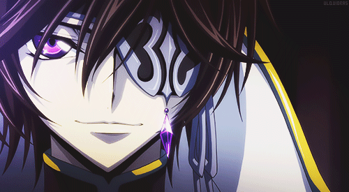

<!--
**ItsSyfe/ItsSyfe** is a ✨ _special_ ✨ repository because its `README.md` (this file) appears on your GitHub profile.
-->

    <h2 align="left">ㅤ$ 𝙬𝙝𝙤𝙖𝙢𝙞</h2>
    
    
I'm Syfe, a college student taking 3 A-Levels, Physics, Maths and Computer Science in the UK. I write code a lot for various small ideas that I have. My projects aren't really that interesting but I've learnt a lot from developing them.

    <ul>
        <li><b>Age: </b>17</li>
        <li><b>Hobbies: </b>Programming, Astronomy</li>
        <li><b>Games: </b>Rust, osu!, Minecraft</li>
        <li><b>Anime: </b>Fate, Black Clover, Code Geass, One Punch Man, Jujutsu Kaisen</li>
        <li><b>Friends: </b><a href="https://github.com/AquaPlaysYT">Aqua</a>, <a href="https://github.com/PsychoPast">Psycho</a>, <a href="https://github.com/SiLeNSwOrD">Droidy</a></li>
    </ul>

    <h2 align="left">ㅤ$ 𝙘𝙙 𝙥𝙧𝙤𝙟𝙚𝙘𝙩𝙨</h2>
    
    
I do development on some small projects, most of which I eventually lose interest in but currently I'm working on <a href="https://yutashi.xyz">Yutashi</a>.  Yutashi is a simple project that aims to open up ease of access to readily made profile pictures and banners for Discord, we want to eventually have a community of users that provide us with a wealth of profile themes and a good moderation team to be able to keep our focus just on development of Yutashi.

    

         
        
<a href="https://yutashi.xyz">Yutashi</a> - <a href="https://myanimelist.net/animelist/ItsSyfe">MAL</a> - <a href="https://discords.com/bio/p/Syfe">Discord</a>

    

